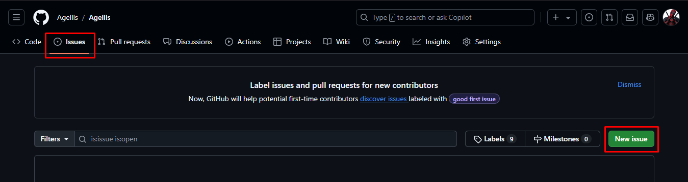
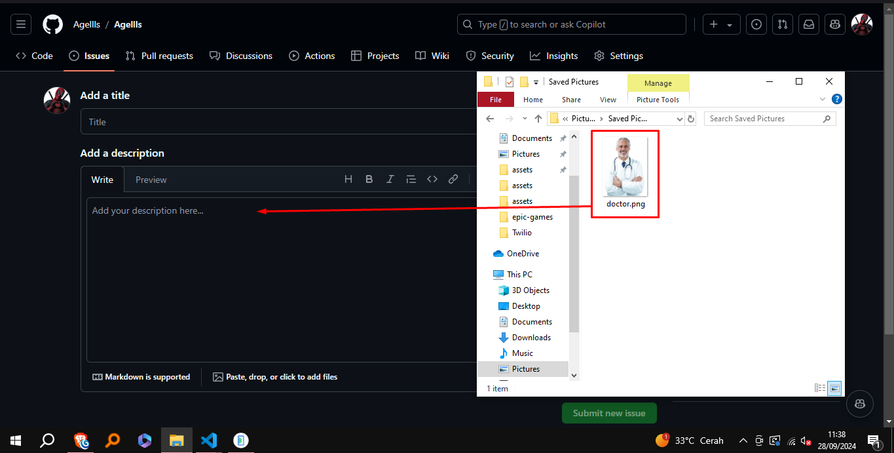
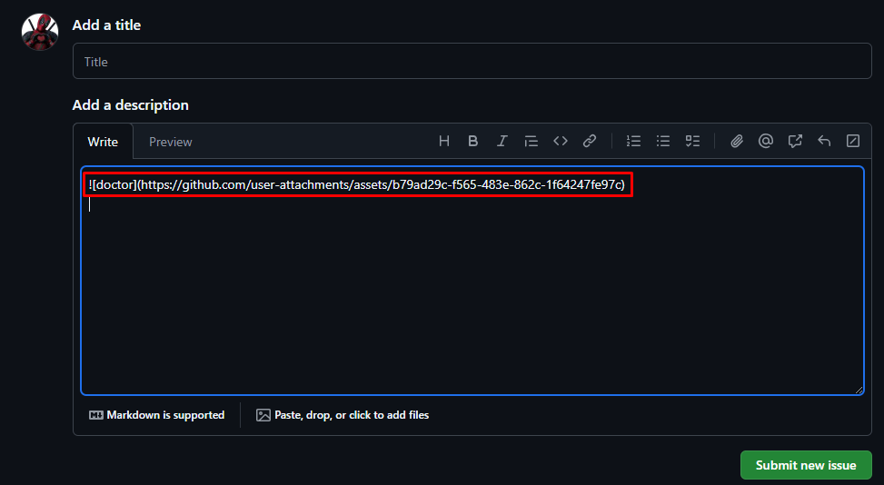

# Get cdn server for image links for free

<li> Open <a href='https://github.com/'>github</a> in your browser
<li> Login your account github
<li> Goto 1 random your repository
<li> Then goto in 'issues'
<li> And now click 'New issue'
 

<li> Then drag and drop your image to here  

<li> Then wait for a minute, the github process upload your image in the cdn
<li> After that it will be generate link like this image

<li> Copy the links and try paste on your browser

Yeyyy youre already have the link of your image, now the tutorials for get server cdn image for free already done, Happy Coding 😁👍
